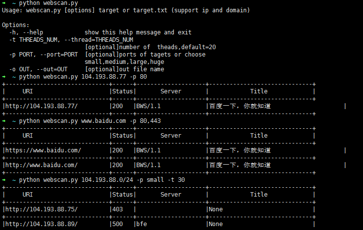

# webscan
场景，经常需对要ip或者域名web服务进行快速探测，所以参考[httpscan](https://github.com/zer0h/httpscan)，改进写的一个web服务发现工具，增加自定义端口和端口列表，支持ip、域名以及目标文件。

    small_ports=[80, 443]
    medium_ports=[80, 443, 8000, 8080, 8443] #default
    large_ports=80, 81, 443, 591, 2082, 2095, 2096, 3000, 8000, 8001, 8008, 8080, 8083, 8443, 8834, 8888, 55672
    huge_ports=80, 81, 300, 443, 591, 593, 832, 981, 1010, 1311, 2082, 2095, 2096, 2480, 3000, 3128, 3333, 4243, 4567, 4711, 4712, 4993, 5000, 5104, 5108, 5280, 5281, 5800, 6543, 7000, 7396, 7474, 8000, 8001, 8008, 8014, 8042, 8069, 8080, 8081, 8083, 8088, 8090, 8091, 8118, 8123, 8172, 8222, 8243, 8280, 8281, 8333, 8337, 8443, 8500, 8834, 8880, 8888, 8983, 9000, 9043, 9060, 9080, 9090, 9091, 9200, 9443, 9800, 9981, 11371, 12443, 16080, 18091, 18092, 20720, 55672

### 环境
- Python 2.7
- pip
### 依赖
- requests
- IPy

